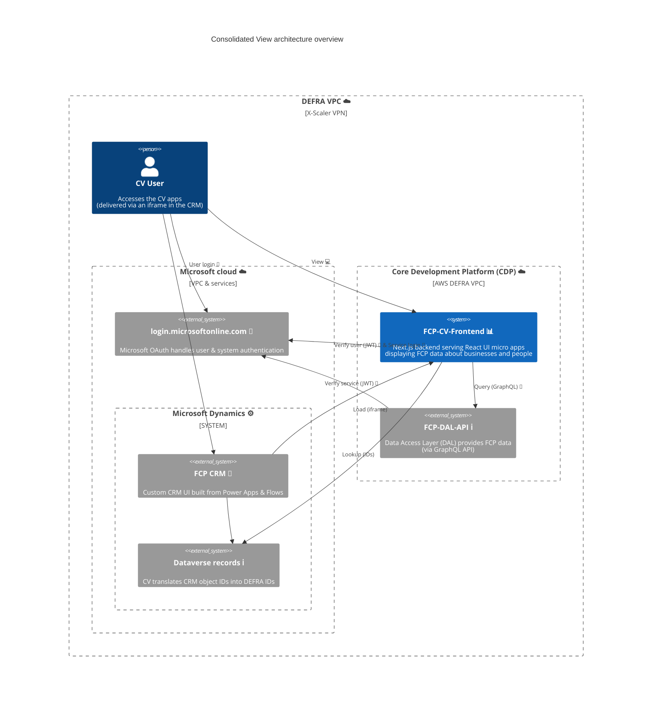

# fcp-cv-frontend

[](https://sonarcloud.io/summary/new_code?id=DEFRA_fcp-cv-frontend)
[](https://sonarcloud.io/summary/new_code?id=DEFRA_fcp-cv-frontend)
[](https://sonarcloud.io/summary/new_code?id=DEFRA_fcp-cv-frontend)

<abbr title="Farming & Countryside Programme">FCP</abbr>'s <abbr title="Consolidated View">CV</abbr> service (a.k.a. <abbr title="Single Customer View">SCV</abbr>).
Principally a `React` frontend UI, built on top of the `Next.js` framework (including a Node.js <abbr title="Backend For Frontend">BFF</abbr>).
The service displays DEFRA data relating to businesses and people, requested form the <abbr title="Data Access Layer">DAL</abbr> API.
The service comprises a collection of micro SPAs delivered through an iframe in the FCP CRM.



## Requirements

### Node.js

Please install [Node.js](http://nodejs.org/) `>= v24` and [npm](https://nodejs.org/) `>= v11`.
You will find it easier to use the Node Version Manager [nvm](https://github.com/creationix/nvm)

To use the correct version of Node.js for this application, via nvm:

```bash
cd fcp-cv-frontend
nvm use
```

### FCP-DAL

CV requires a connection to an instance of the <abbr title="Data Access Layer">DAL</abbr> API which is the primary datasource.
The DAL can be setup to create a mock service suitable for local testing and development by running the following commands:

```bash
curl https://raw.githubusercontent.com/DEFRA/fcp-dal-api/refs/heads/main/compose.yml -o dal-api-compose.yml
docker compose -f dal-api-compose.yml up --pull always --quiet-pull fcp-dal-api
```

More details about the DAL can be found at the [project README](https://github.com/DEFRA/fcp-dal-api?tab=readme-ov-file#fcp-dal-api), or its [documentation home](https://defra.github.io/fcp-dal-api/homepage).

Once the DAL has been started, a local CV environment can then easily be completed by running the following command:

```bash
docker compose up --build fcp-cv-frontend
```

## Proxy

We are using forward-proxy which is set up by default on CDP.
No special effort is required to configure or use the out-bound proxy, it works automatically.
By default, access to `login.microsoftonline.com` is allowed, as well as to other CDP services, i.e. the DAL.
The only other service required by the app is the Dataverse for the associated CRM instance that provides CV, which has already been configured for each environment (as such, no further proxy config should be necessary).

## Local Development

### Setup

Install application dependencies:

```bash
npm install
```

### Development

To run the `Next.js` server to access the application in `development` mode run:

```bash
npm run dev
```

### Production

To mimic the application running in `production` mode locally run:

```bash
npm start
```

### NPM scripts

All available NPM scripts can be seen in [package.json](./package.json)
To view them in your command line run:

```bash
npm run
```

### Update dependencies

To update dependencies use [npm-check-updates](https://github.com/raineorshine/npm-check-updates):

> The following script is a good start. Check out all the options on
> the [npm-check-updates](https://github.com/raineorshine/npm-check-updates)

```bash
ncu --interactive --format group
```

### Formatting

Formatting is provided by `prettier`.
To check for issues, run:

```bash
npm run lint
```

...and to automatically fix issues, run:

```bash
npm run lint:fix
```

> NOTE: auto-save and automatic linting as an on save action have been setup for the VS Code IDE (see `./.vscode/settings.json`)

#### Windows prettier issue

If you are having issues with formatting of line breaks on Windows update your global git config by running:

```bash
git config --global core.autocrlf false
```

## Docker

### Development image

> [!TIP]
> For Apple Silicon users, you may need to add `--platform linux/amd64` to the `docker run` command to ensure
> compatibility fEx: `docker build --platform=linux/arm64 --no-cache --tag fcp-cv-frontend`

Build:

```bash
docker build --target development --no-cache --tag fcp-cv-frontend:development .
```

Run:

```bash
docker run -p 3000:3000 fcp-cv-frontend:development
```

### Production image

Build:

```bash
docker build --no-cache --tag fcp-cv-frontend .
```

Run:

```bash
docker run -p 3000:3000 fcp-cv-frontend
```

### Docker Compose

A simple local environment with:

- The DAL dependency setup
- This service

```bash
docker compose up --build -d
```

### SonarCloud

SonarCloud has been setup for this repo, see the [sonar-project.properties](./sonar-project.properties) file for config.

## Test structure

### How to run tests

There are 2 distinct sides to the unit tests for this project, which reflect the different environments where the service is run:

- the server-side code (and some basic SSR snapshot tests for the UI components) can be run in watch mode:

  ```bash
  npm run test:server
  ```

- the client-side UI can be rendered (also in watch mode) thanks to `vitest`'s "browser mode", by running:

  ```bash
  npm run test:browser
  ```

- the default, runs both sets of tests, producing a combined coverage report ✨
  ```bash
  npm t
  ```
  > NOTE: this mode is script friendly, and is run by the github Actions CI workflow

### Running accessibility tests

A docker compose exists for running an
[AXE](https://www.npmjs.com/package/@axe-core/cli).Run:

```bash
npm run test:accessibility:docker
```

### E2E tests

TODO: Gordon

### Performance tests

TODO: Gordon

## Licence

THIS INFORMATION IS LICENSED UNDER THE CONDITIONS OF THE OPEN GOVERNMENT LICENCE found at:

<http://www.nationalarchives.gov.uk/doc/open-government-licence/version/3>

The following attribution statement MUST be cited in your products and applications when using this information.

> Contains public sector information licensed under the Open Government license v3

### About the licence

The Open Government Licence (OGL) was developed by the Controller of Her Majesty's Stationery Office (HMSO) to enable
information providers in the public sector to license the use and re-use of their information under a common open
licence.

It is designed to encourage use and re-use of information freely and flexibly, with only a few conditions.
